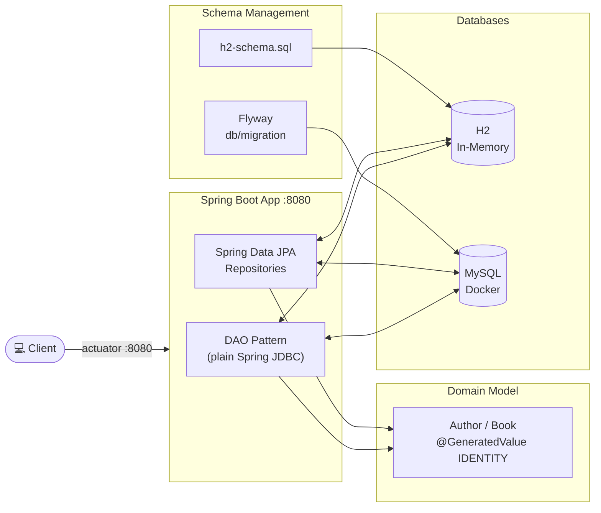
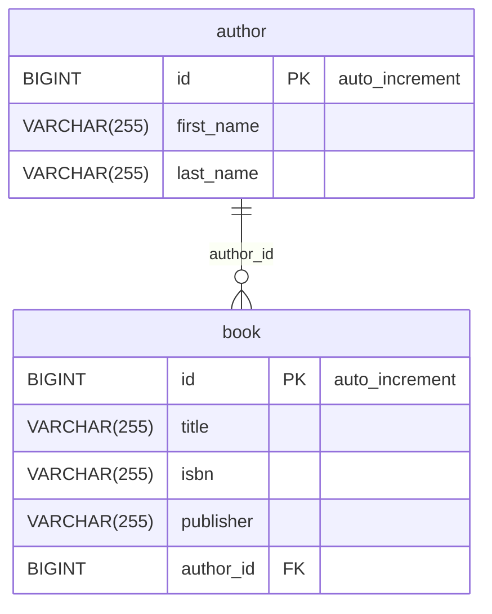
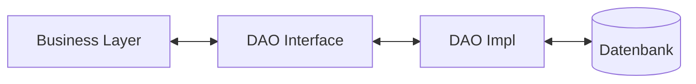

# Introduction to Spring Data JPA - DAO Pattern

Spring Boot 4 / Spring Data JPA demo project on Java 25, demonstrating the classic DAO (Data Access
Object) pattern with plain Spring JDBC and Spring Data JPA repositories against H2 (MySQL-compat mode)
and MySQL, with schema management via Flyway.

## Architecture Overview



## Database Schema



## Java DAO Pattern

- DAO - Data Access Object
- Pattern was a precursor to JPA, before ORMs become popular
- Older and uses JDBC for data access
- Common to see in legacy J2EE applications
- While not common in use anymore, it is a good way to utilize JDBC
- Very similar to the Repository Pattern used by Spring Data
- DAO Pattern - Purpose is to isolate persistence operations from the application layer
- For example, when the application needs to persist an object, it should not need to understand the underlying persistence technology
- Domain Class - Simple POJOs, same as JPA entities
- NOTE: DAO Pattern will not utilize JPA annotations
- DAO API - Provide interface for CRUD operations (similar to Repository)
- DAO Implementation - Implement persistence functionality



Interpretation

- Die Business Layer enthält die Geschäftslogik.
- Sie kommuniziert mit der DAO Interface.
- Die DAO Interface definiert den Zugriff auf Daten, ohne die technische Umsetzung festzulegen.
- Die DAO Impl implementiert dieses Interface.
- Die DAO Impl liest Daten aus der Datenbank und schreibt Daten in die Datenbank.

## Flyway

Flyway is enabled in the `mysql` profile (see `application-mysql.yaml`). That profile starts MySQL on
port 3306 using the Docker Compose file `compose-mysql.yaml`.

## Docker

The Docker Compose file uses the startup script `src/scripts/init-mysql.sql`, which creates the
database and users.

## Kubernetes

### Generate Config Map for mysql init script

When updating `src/scripts/init-mysql.sql`, apply the changes to the Kubernetes ConfigMap:

```powershell
kubectl create configmap mysql-init-script --from-file=init.sql=src/scripts/init-mysql.sql --dry-run=client -o yaml | Out-File -Encoding utf8 k8s/mysql-init-script-configmap.yaml
```

### Deployment with Kubernetes

To deploy all resources:

```bash
kubectl apply -f k8s/
```

To remove all resources:

```bash
kubectl delete -f k8s/
```

Check

```bash
kubectl get deployments -o wide
kubectl get pods -o wide
```

### Deployment with Helm

Be aware that we are using a different namespace here (not default).

Go to the directory where the tgz file has been created after 'mvn install'

```powershell
cd target/helm/repo
```

unpack

```powershell
$file = Get-ChildItem -Filter sdjpa-jdbc-chart-*.tgz | Select-Object -First 1
tar -xvf $file.Name
```

install

```powershell
$APPLICATION_NAME = Get-ChildItem -Directory | Where-Object { $_.LastWriteTime -ge $file.LastWriteTime } | Select-Object -ExpandProperty Name
helm upgrade --install $APPLICATION_NAME ./$APPLICATION_NAME --namespace sdjpa-jdbc --create-namespace --wait --timeout 5m --debug
```

show logs

```powershell
kubectl get pods -n sdjpa-jdbc
```

replace $POD with pods from the command above

```powershell
kubectl logs $POD -n sdjpa-jdbc --all-containers
```

Show Endpoints

```powershell
kubectl get endpoints -n sdjpa-jdbc
```

test

```powershell
helm test $APPLICATION_NAME --namespace sdjpa-jdbc --logs
```

status

```powershell
helm status $APPLICATION_NAME --namespace sdjpa-jdbc
```

uninstall

```powershell
helm uninstall $APPLICATION_NAME  --namespace sdjpa-jdbc
```

delete all

```powershell
kubectl delete all --all -n sdjpa-jdbc
```

create busybox sidecar

```powershell
kubectl run busybox-test --rm -it --image=busybox:1.36 --namespace=sdjpa-jdbc --command -- sh
```

You can use the actuator rest call to verify via port 30080

## Running the Application

1. Choose between h2 or mysql for database schema management. (you can use one of the preconfigured intellij runners)
2. Start the application with the appropriate profile and properties.
3. The application will use Docker Compose to start MySQL and apply the database schema changes.

## Sandbox (local dev environment)

The sandbox is provisioned by the opencode-sandbox-kit and runs as a Docker container. It mounts this
repo, starts the agent, and connects the IntelliJ MCP server. The app runs on port `8080`; `compose-mysql.yaml`
provides MySQL.

Allow the kit source (GitHub without cloning):

```powershell
sbx settings set kit.allowedSources --% "[\"docker.io/\",\"github.com/dboeckli/\"]"
```

Start a new sandbox:

```powershell
sbx run opencode `
    --kit "git+https://github.com/dboeckli/opencode-sandbox-kit.git#dir=opencode-agent" `
    --template docker/sandbox-templates:opencode-docker-0.5.0 `
    --no-share-skills `
    --static-mcp idea `
    . `
    "C:\development\maven-repo:ro"
```

Start the sandbox with Kubernetes support:

```powershell
sbx run opencode `
    --kit "git+https://github.com/dboeckli/opencode-sandbox-kit.git#dir=opencode-agent" `
    --template docker/sandbox-templates:opencode-docker-0.5.0 `
    --no-share-skills `
    --static-mcp idea `
    . `
    "C:\development\maven-repo:ro" `
    "$env:USERPROFILE\.kube:ro"
```

Claude Code (Home) and Mammouth Code variants:

```powershell
sbx run claude `
    --kit "git+https://github.com/dboeckli/opencode-sandbox-kit.git#dir=opencode-agent" `
    --template docker/sandbox-templates:claude-code-docker-0.5.0 `
    --no-share-skills `
    --static-mcp idea `
    . `
    "C:\development\maven-repo:ro"
```

```powershell
sbx run "git+https://github.com/dboeckli/opencode-sandbox-kit.git#dir=mammouth-agent" `
    --no-share-skills `
    --static-mcp idea `
    . `
    "C:\development\maven-repo:ro"
```

### Start the app

Start MySQL (H2 needs no Docker):

```shell
docker compose -f compose-mysql.yaml up
```

Then run one of the IntelliJ run configurations (`.run/Spring6Application h2.run.xml` or the MySQL
one) or start via `./mvnw spring-boot:run -Dspring-boot.run.profiles=h2`.

### Sandbox build quirk

The sandbox mounts the repo via filesystem passthrough, which blocks symlinks — Spotless's `npm install`
(prettier) would fail with `EPERM` unless npm skips bin links. The kit sets `npm_config_bin_links=false`
globally, so no manual export is needed.

